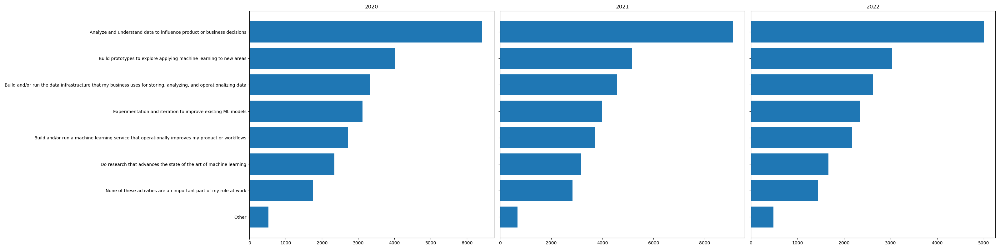
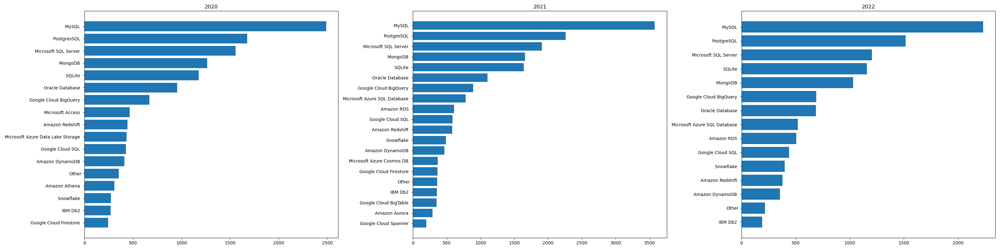

# Kaggle Survey Analysis for Data Scientsit

## Introduction

The "Data Scientist's Toolbox" project conducts a longitudinal study using the Kaggle Machine Learning and Data Science Survey questionnaires from 2020, 2021, and 2022 hosted on [kaggle.com](https://www.kaggle.com). It performs an exploratory analysis addressing the following three common beginner questions:

- **What job titles are associated with data science roles?**
- **What does a typical day in a data science job look like?**
- **What skills and knowledge are required to work in data science?**

We used `pandas` and `sqlite3` to build a database, and `matplotlib` to perform a proof-of-concept and produce the final visualizations.

## How to Reproduce

- Install Miniconda.
- Create the environment using the `environment.yml` file:
    ```bash
    conda env create -f environment.yml
    ```
- Place the CSV files:

    `kaggle_survey_2020_responses.csv`
    `kaggle_survey_2021_responses.csv`
    `kaggle_survey_2022_responses.csv`

  into the `data/` folder located in your working directory.
Build the database:

- Activate the environment and run:

    ```bash
    python create_kaggle_survey_db.py
    ```

    This will create `kaggle_survey.db` in the `data/` folder.

- Generate the plots, activate the environment and run:
    ```bash
    python create_longitudinal_analysis_plots.py
    ```
    This will output six horizontal bar charts.

- **What job titles are associated with data science roles?**

Student, Data Scientist, Softeware Engineer, etc.
- **What does a typical day in a data science job look like?**

Analyze and understand data to influence product or business decision, Build prototype to explore applying machine learning to new areas, etc.
- **What skills and knowledge are required to work in data science?**

Python, SQL, C++, R, etc.

MySQL, PostgreSQL, Microsoft SQL server, Mongo DB, etc.

Matplotlib, Seaborn, Ploty, Ggplot, etc.

Linear or Logistic Regression, Decision Tree or Random Forest, Gradient Boosting Mashine, Convolutional Neural Network, etc.